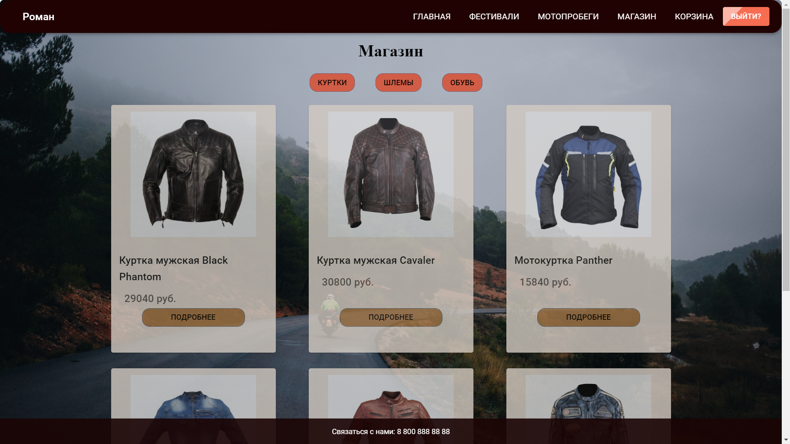
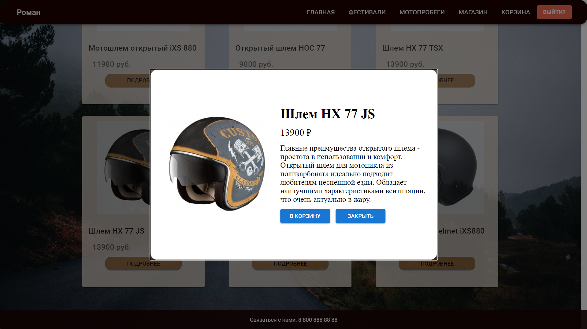
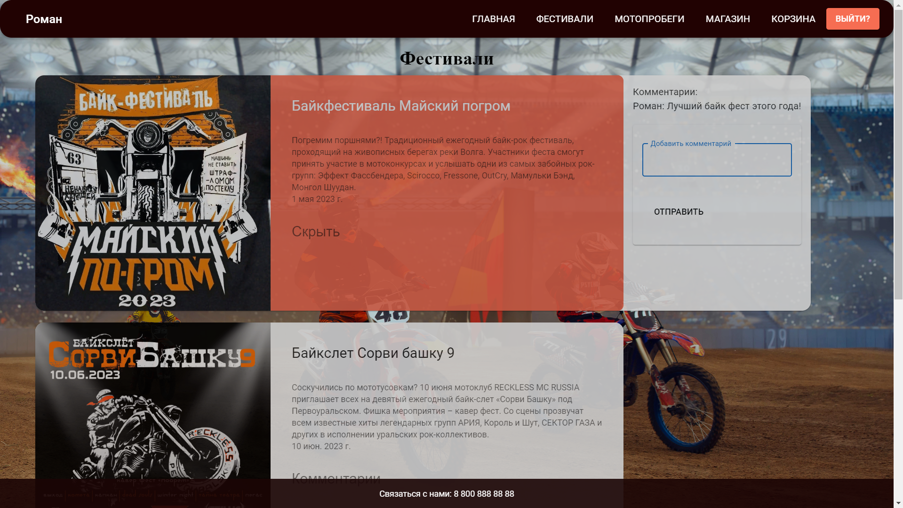
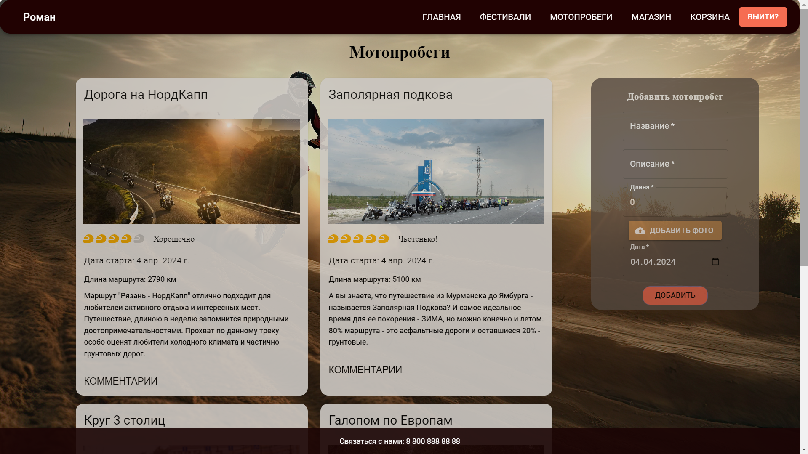

## 🚀 Bikery 
This is a website where freedom is not just a word, but a way of life. Bikery is for everyone who likes to feel the real speed and the spirit of the movement on their steel horses and become part of strong biker community. We encourage rebellion against the mundane and together we create epic stories on the dusty roads. Join us!

## 🛒 Shop
There is a Shop for true bikers where they can order leather moto jackets, helmets and boots:

## 💲 Shop - modal window
You can open a modal window with description of exact product:

## 🚩🚩🚩 Festivals
Visitors of Bikery website can also checkout info about future bike festivals:

## 🏍️ Races
Registered users can even add their motorace routes to gather lonely bikers together and ride into the sunset:

## 📝 License

This project is licensed under the Copyright © 2024 Alexander Grimalyak, Ekaterina Zakharova, Roman Dakaev and Ivan Ivanov.
